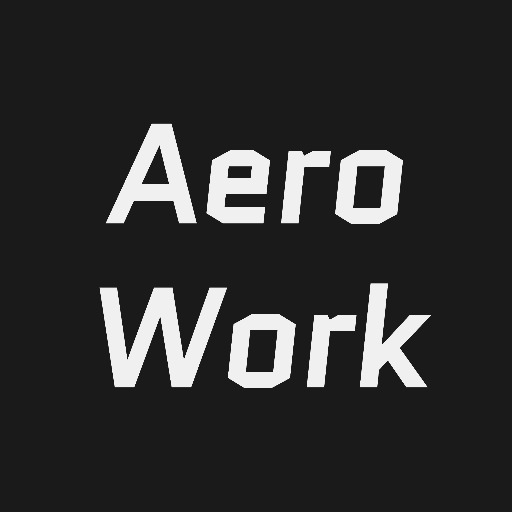

# Aero Code

A cross-platform GUI for AI coding agents.



## About

Inspired by Anthropic's [Cowork](https://claude.com/blog/cowork-research-preview), Aero Code aims to bring AI agent capabilities to everyone - not just developers. While Cowork is macOS-only and requires Claude Max, Aero Code is open-source, cross-platform, and works with any Anthropic-compatible API.

### Design Principles

**Speed** - Built with Tauri + Rust for a lightweight, fast experience. The Rust backend manages all sessions and agent processes efficiently, with minimal memory footprint compared to Electron alternatives.

**Collaboration** - Work from anywhere. Start on desktop, monitor and control from your phone via PWA. Combine with [Tailscale](https://tailscale.com/) for secure remote access - approve permissions, check task status, and manage your agent from anywhere.

**Standardization** - Uses [Agent Client Protocol (ACP)](https://github.com/anthropics/agent-client-protocol) for Claude Code integration. Future plans include support for OpenCode, Gemini CLI, and other ACP-compatible agents.

## Highlights

| | |
|---|---|
| **Agent Chat** | Real-time streaming, tool call visualization, permission prompts |
| **File Browser** | Syntax highlighting, image/PDF preview, remote file management |
| **Terminal** | Full PTY support, works locally and remotely |
| **Session Management** | Create, resume, fork sessions with full history |
| **Yolo Mode** | "You Only Look Once" - auto-approve all tool calls |
| **Permission Rules** | Fine-grained control with regex patterns for tools and paths |
| **Multi-Provider** | Anthropic, Amazon Bedrock, BigModel/Zhipu, MiniMax, Moonshot AI/Kimi, Custom |
| **MCP Servers** | Visual management of Claude Code's MCP servers |
| **Skills** | Enable/disable Claude Code skills through UI |
| **Remote Access** | Everything works via WebSocket - use from phone PWA |
| **i18n** | English, Chinese |
| **Themes** | Light / Dark / System |

## Quick Start

**Prerequisites:** [Bun](https://bun.sh/), [Rust](https://rustup.rs/), Claude Code (`npm i -g @anthropic-ai/claude-code`)

```bash
# Install
bun install

# Desktop app
bun run tauri dev

# Web app (run both commands)
cargo run --bin aero-server --manifest-path src-tauri/Cargo.toml
bun run dev
# Open http://localhost:5173
```

## Build

```bash
bun run tauri build   # Desktop
bun run build         # Web
```

## Model Providers

Configure in **Settings > Models**. Environment variables are passed to the agent process at startup.

| Provider | Configuration |
|----------|---------------|
| Default | Uses system environment variables |
| Anthropic | API Key / Auth Token, Base URL, Model selection |
| Amazon Bedrock | Bearer Token, Region, Model selection |
| BigModel / Zhipu | Auth Token |
| MiniMax | Auth Token, Model selection |
| Moonshot AI / Kimi | Auth Token, Model selection |
| Custom | Base URL + API Key / Auth Token |

Config stored in: `~/.config/aerowork/models.json`

## Configuration

All config files are stored in `~/.config/aerowork/`:

| File | Purpose |
|------|---------|
| `config.json` | General settings |
| `models.json` | Model provider configuration |
| `mcp.json` | MCP server configuration |

## Tech Stack

- **Frontend:** React 18, TypeScript, Tailwind CSS v4, shadcn/ui, Zustand
- **Backend:** Tauri 2.0, Rust, Axum
- **Protocol:** Agent Client Protocol (ACP)

## License

MIT
